# BaseJump

Basejump is a clone of the popular project management app [Basecamp](https://basecamp.com/)

It is used to manage company communications, events, and tasks.
Basejump is intended to be an almost pixel perfect clone of Basecamp, with basic functionality of making Todo Lists, Todos, Events, and Project Wide Messages

## Demo

Check out [Basejump](https://basejumpapp.herokuapp.com) live!

***

### Landing Page

When not logged in, the app displays only three pages, the landing page, sign in, and sign up. User authentication is performed in the backend with the help of Ruby BCrypt.

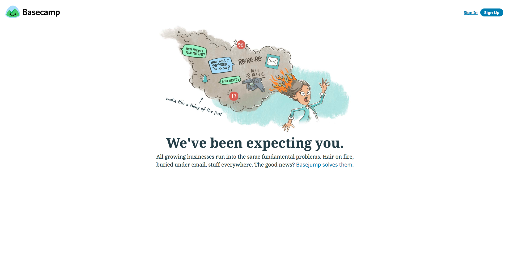

### Sign In / Up Page

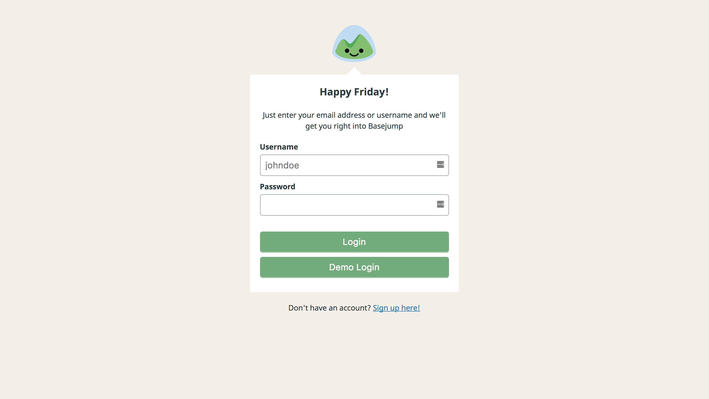
***
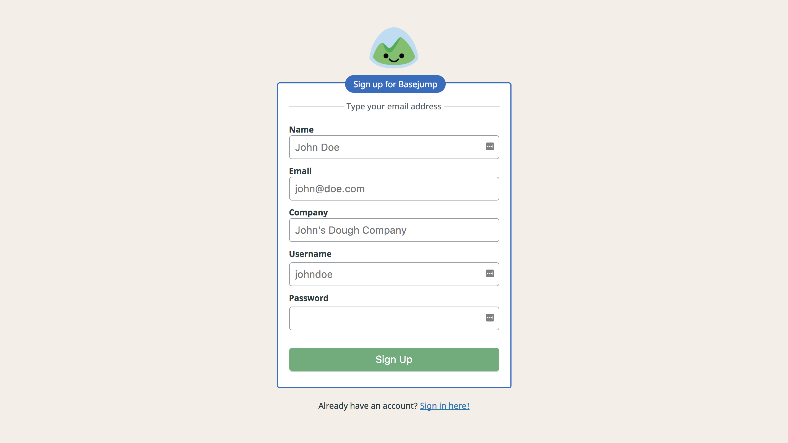

### Main App

#### Home Page

The initial home page shows the user all the projects they are associated with. Every user is associated to three main categories of "projects"
* Company
* Teams
* Projects

All users are associated to a single Company project, named "Company HQ" by default.

Teams are like the various departments of a company, and Projects are the various projects the company may be working on.

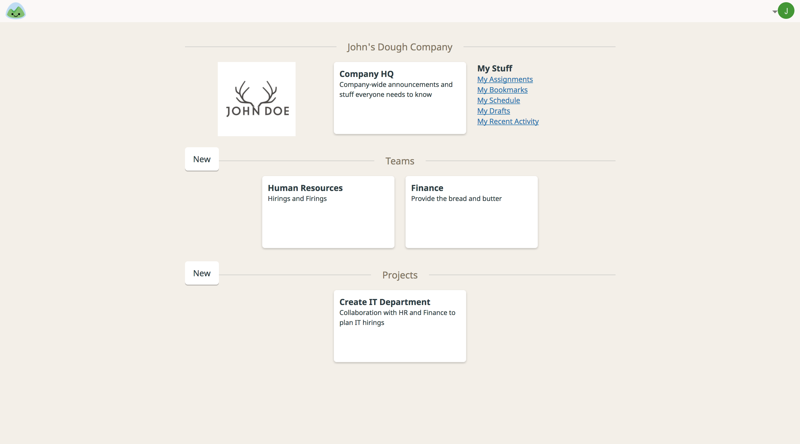

#### Project View

Each project has 3 "tools" by default:
* Message Board
* Todos
* Schedule

(Basecamp has a few more which include a live team chat, and file storage)

The project view acts as a menu to link to each tool available to the project. The top of the page lists the various users associated to the project, in future versions of this app, a project admin can add more users to a project. Tool cards link to each tool, in future versions of this app, tool cards will display previews of the items inside each tool.

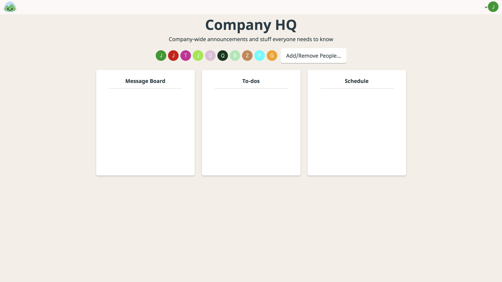

#### Message Board

Members of a project can post Project Wide Messages that other team members can respond to. These are used to make announcements, FYI's, ask questions, etc. among the team members.

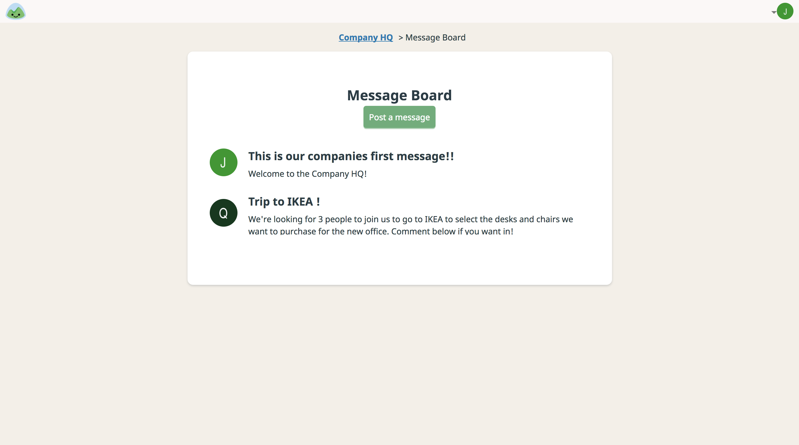

A user can comment on a message in the message view page

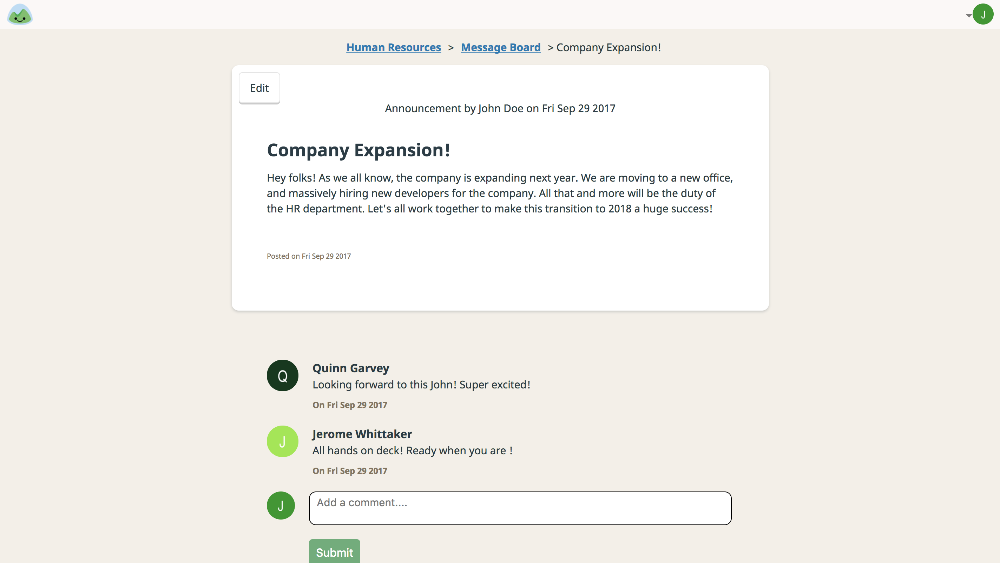

A user can create or edit a message in the New Message Page

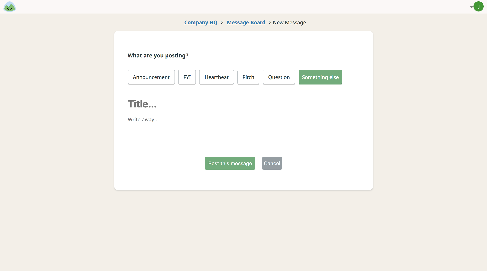

#### Todos

The base function of Basejump is to manage tasks, which are done through the Todo List functionality. Users can create new Todo Lists and add todos to each list. In future version of this app, todos can be assigned to a user / many users and scheduled to have a due date.

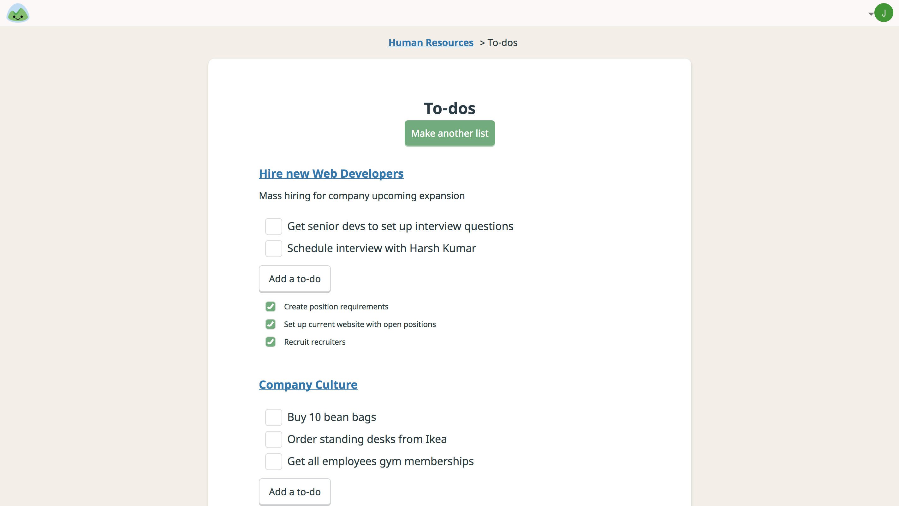
***
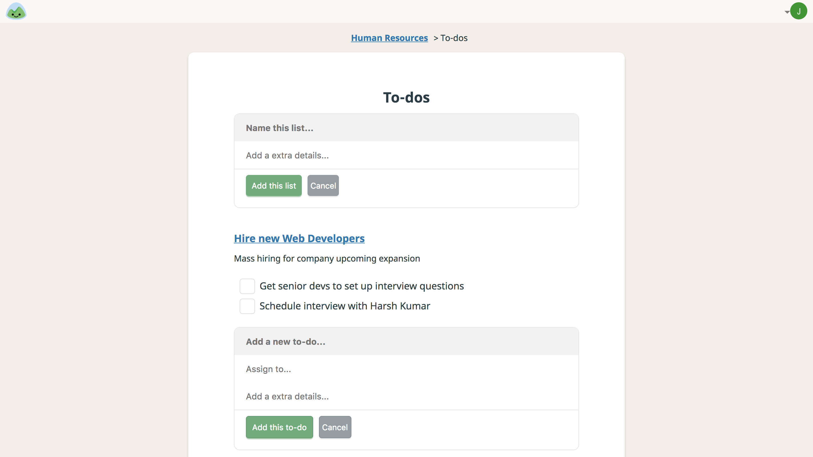

Users can comment on individual todo lists

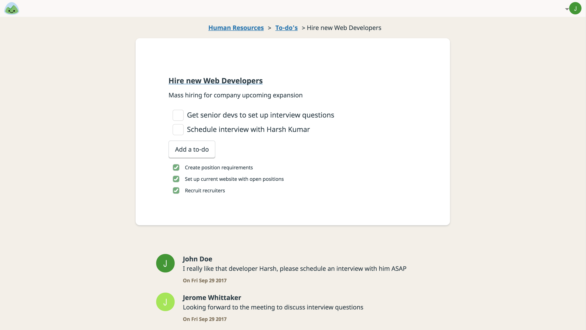

#### Schedule

Users can post project related events on the Schedule Page. A calendar displays all events, and on clicking various dates will list out the events taking place on that specific date and upcoming events

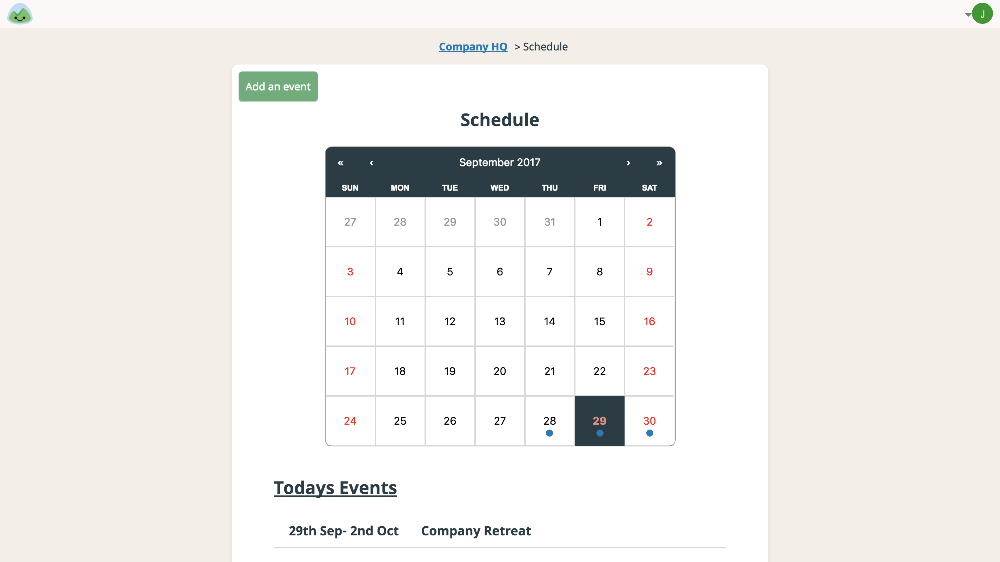
***
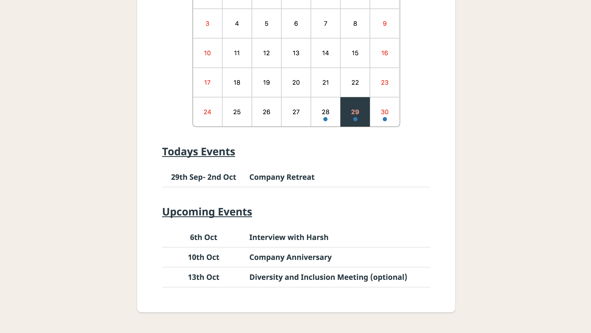
***
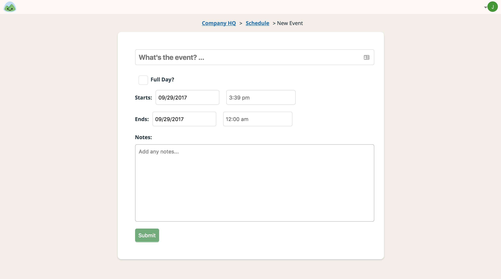

Users can comment on individual events

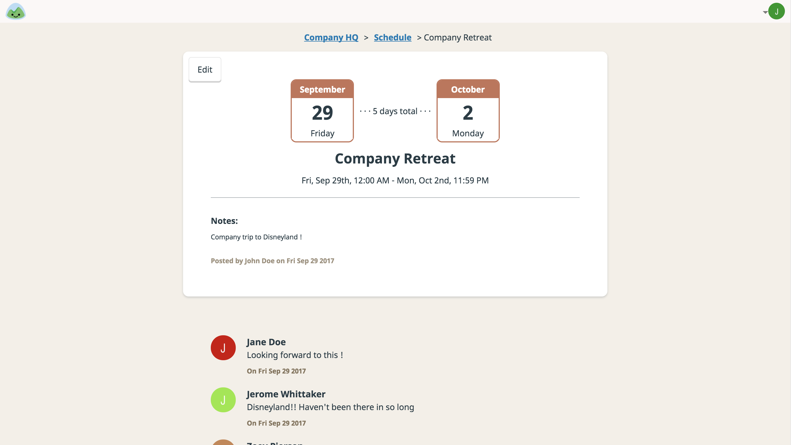

### Technologies Used

Basejump was developed using Ruby on Rails for the backend and ReactJS for the frontend.

Authentication was performed using BCrypt Gem that allows the storage of password digests in the backend.

Various Node libraries were used in this project, most notably [MomentJs](https://momentjs.com/) and [React-Calendar](https://www.npmjs.com/package/react-calendar).

#### Technical Challenges

The biggest challenge faced in this project was the usage of MomentJs along with React Calendar to sort and display events. It should be noted that MomentJS is an extremely powerful library that can be used to display various time and date related strings and other date-time related functionality.
